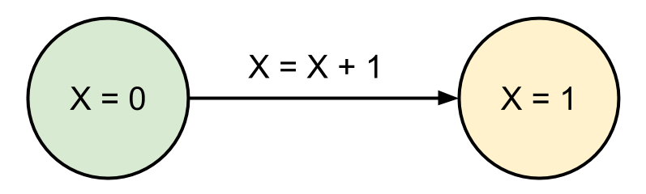
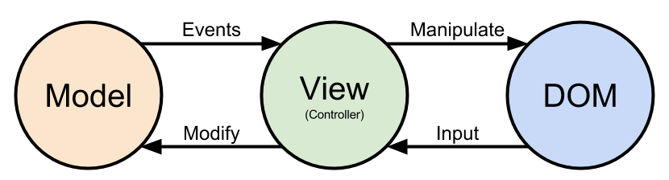
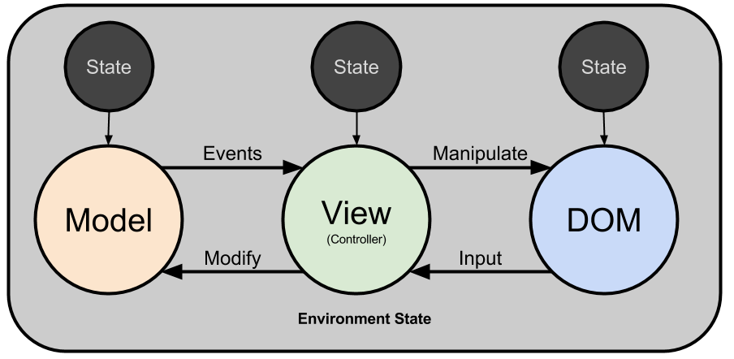
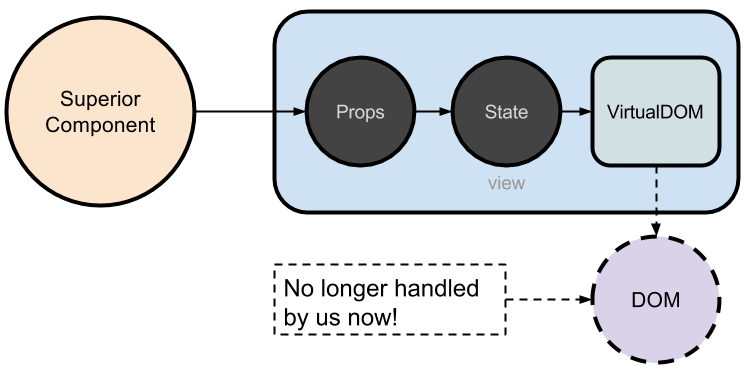
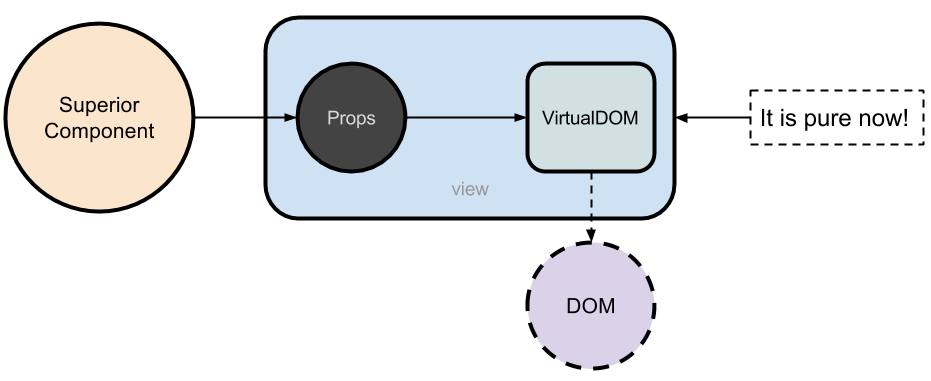
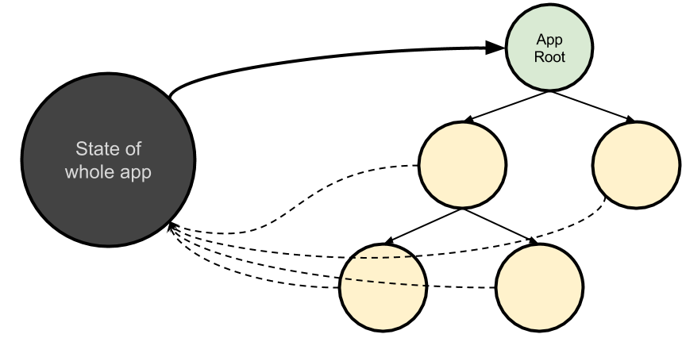
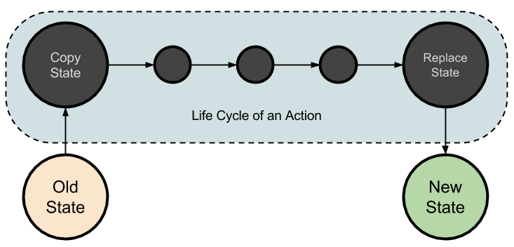
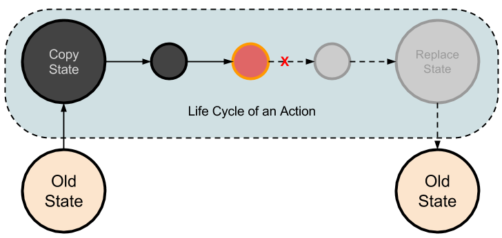

<!-- $theme: gaia -->
<!-- $size: 16:9 -->

# Say Hello to React


---

# Table of Contents

- Introduction
	- VirtualDOM
	- Pure component
	- Flux
- How DBX uses React
	- MobX
	- Provider Pattern
	- Glue Layer


---

# Introduction

- We have so many questions to ask
	- What is React?
	- What is VirtualDOM, JSX?
	- What is pure component? Why we need immutable data structures?
	- What is Flux? What's the relationship between Flux and Redux?
	- ...
- The most important question is that **why we need all of this**?

---

# Perspective of Software


Alan Turing (1912.6 - 1954.6)

**The Turing Machine**

---

# Perspective of Software

Our softwares are barely running as an infinite set of states with a series of actions applied on old states and transform them into new ones.



---

# Perspective of Software

A simple portray of Backbone's MVC pattern.



---

# Question

How many separated states are there in the graph below?


---

# Answer

At least **FOUR**.




---

# What do we want?

- Consistent states.
- Fewer states.
- Safer actions.

---

# React's Way

---

# VirtualDOM

Bare HTML Doms are managed by React. We are working with VirtualDOM. React provides JSX to allow us write HTML like template.

```jsx
class Example extends React.Component {
	render() {
    	/* some calculation */
        return (
            <ul>
            	<li>item 1</li>
            	<li>item 2</li>
                <li>item 3</li>
            </ul>
        );
    }
}
```

---

# VirtualDOM

React get to know how to change bare DOMs by compare versions of VirtualDOM tree. React smartly find minimum count of actions need to change the bare DOM, that's why it's so fast.

```diff

  <ul>
      <li>item 1</li>
-     <li>item 2</li>
-     <li>item 3</li>
+     <li>item 4</li>
+     <li>item 5</li>
  </ul>
```

---
# VirtualDOM
```es6
class SubComponent extends React.Component {
    render() {
    	return (<Input value={this.props.value} />)
    }
}

class Component extends React.Component {
    render() {
    	return (
        <div>
        	<SubComponent value="Test" />
        </div>
        );
    }
}
```

---
# VirtualDOM
```html
// What we got:
<div>
    <Input value="Test" />
</div>
```
The render is executed recursively so that eventually we will get a tree of virtualDOMs.

---

# VirtualDOM

VirtualDOM tree is built recursively in component's render method. It is calculated by two inputs:

-  **Props** from superior component
- **State** of current component

Rerender of a component happens on:

- `this.setState({someProp: someValue)` is called
- `render` method of parent component is triggered and thus `props` is changed.

---

# What do we have now?

Fewer states, stronger consistent gaurantee between view and DOMs.



---

# Pure

Wait! We still have state in VirtualDOM, isn't it?

Yes. But...

1. If the virtualDOM is rendered by a sub component, the state is handled by the sub component itself and we neither need nor able to change it directly from a superior component.
2. If it is a build-in component, the virtualDOM is **Pure**. Which means there is no states attached in our abstraction. (Although there must be some state in deeper perspective).

---

# Pure

What if we turn our component into something without its own state too? We will have a component only respond to `props`'s change.

Which means, anytime when we give the same `props` to it, it will produce the same result.

We call such component **Pure Component**.

```
// A shortcut for Pure Component (Stateless Component)
const MyPureComponent = function MyPureComponent(props) {
    return (<div>{props.text}</div>);
}
```

---

# Pure

We have a pure component now. But what about it's children?



---

# Pure

A component can be strictly pure. A strictly pure component should:

1. It is a pure component without internal states
2. It receives (nearly) no effects from environment
3. Its children are all strictly pure

---

# Pure

We love functional programming, what if we make the root component of our app strictly pure?



---

# Pure

A pure app is:

1. Easy to maintain. We only have one state to update. Whatever the source of an action is (user input, websocket, Restful API), we just apply it to our center state.
2. Easy to debug. The state of the whole app is in a single place, and our app is pure, so we can dump everything when bugs happened and reproduce them at ease.
3. We have a clearer flow of actions and different module is just well organized. It is likely that we will write better code.

---

# Pure

But...

1. It's hard to bootstrap. We may need quite a few lines before it starts to work.
2. Passing `props` layer by layer is something that is really ugly.
3. Not that flexible for tiny actions. (ex. inputs in a form)
4. Comparing the whole App's virtualDOM tree is costly.

---

# Immutability

To avoid costly comparing through the app's whole virtualDOM tree. We can make use of `shoudComponentUpdate` to trim some branches.

```es6
class MyComponent extends React.Component {
    shouldComponentUpdate(nextProps) {
     	let update = false;
        for (let propName in this.props) {
       	    update = update || (this.props[propName] === nextProps[propName]);
        }
        return update;
    }
}
```

But, it is a little tricky here.

---

# Immutability

```js
const a = {value: 0};
const b = a;
const c = {value: 0};

// We changed the value
b.value = 1;

// check a and b
a === b; // true, thus react can not aware of the change

// check a and c
a === c; // false, but they are exactly the same

// should we use deepEqual?
_.deepEqual(a, c) // true, but it is costly
```

---

# Immutability

Immutability to rescue. We have two solutions:

1. For smaller apps, we use [immutability-helper](https://github.com/kolodny/immutability-helper). It copies objects for us when modifying nested structure.
2. For larger apps, we use [ImmutableJS](https://facebook.github.io/immutable-js/). A set of immutable datastructures internally implement Vector Trie and HAMT (like that used in Clojure and Scala). Objects or arrays share internal structures with the old one after modification to save memory space.

Then we can trust the result of `a === b`. Only perform deep comparing otherwise.

---

# Safer Actions

The problem of concurrency:

```js
// Procedure 1

let a = takeMoney(username);
a = a + 1000;
updateMoney(username, a);


// Procedure 2
let a = takeMoney(username);
a = a - 500;
updateMoney(username, a);
```
Multiple different results we may have.

---

# Safer Actions

Luckily, JavaScript do not have really parallel. But what if we have an error in the middle of action?


It will be a disaster if we allow an action stops at an intermediate state, which means the whole app comes into somewhere undefined!

---

# Safer Actions

The database has transactional. We have Software Transaction Memory. But STM is an over kill. We can just use two steps commit.



---

# Safer Actions
If an error happens, it will still be the old state at last and the app is safe. If you are using an immutability solution this way just drops in natrually.


---

# Flux


React + Pure Component + Immutability + Safer Action = **Flux**

That's it!